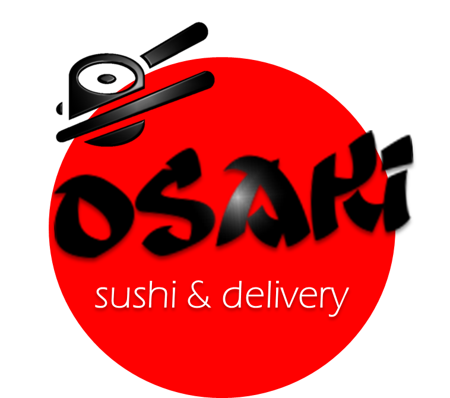
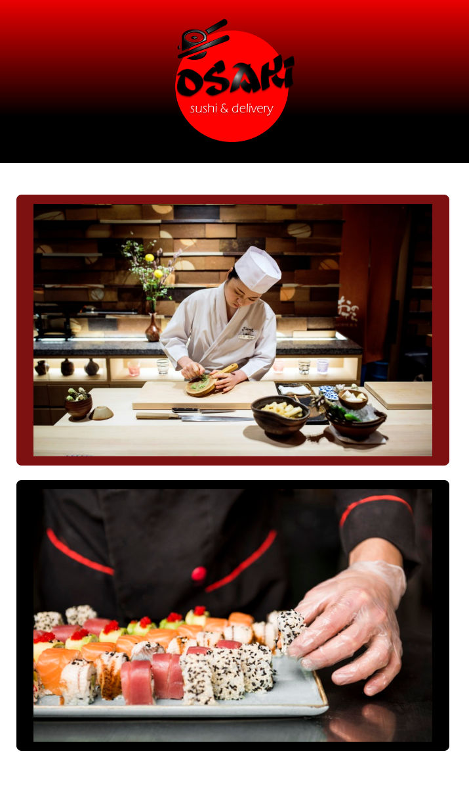
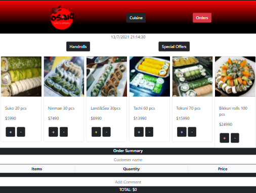
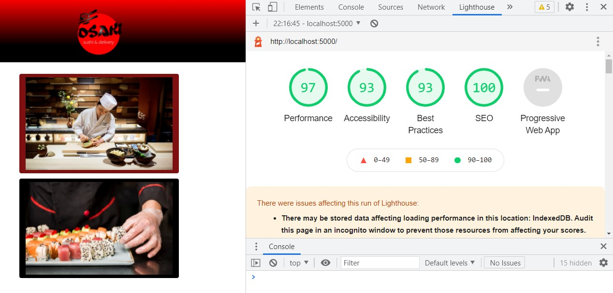

# Osaki Sushi

* [1. Introducción](#1-introducción)
* [2. Presentación de Osaki sushi](#2-Presentación-de-Osaki-sushi)
* [3. Historias de usuario](#3-Historias-de-usuario)
* [4. Puntuación de la App](#4-Puntuación-de-la-App)

***

## 1. Introducción
Este proyecto es una interfaz en la que se pueden tomar pedidos usando una tablet, y enviarlos a la cocina para que se preparen ordenada y eficientemente. La interfaz muestra los dos menús, cada uno con todos sus productos. El usuario, en este caso el waiter puede ir eligiendo qué productos agregar y la interfaz va mostrando el resumen del pedido con el costo total.

Asimismo, está construido sobre la base de [React](https://es.reactjs.org/) ya que es uno de los _frameworks_ de JavaScript más utilizados por lxs desarrolladorxs alrededor del mundo, y hay una razón para eso.
En el contexto del navegador, mantener la interfaz sincronizada con el estado
es difícil. Al elegir React, me apoyé en una serie de convenciones e implementaciones _probadas_ y _documentadas_ para
resolver un problema común a toda interfaz web. 

Cuando elegimos una de estas tecnologías no solo importamos un pedacito de
código para reusarlo (lo cuál es un gran valor per se), si no que adoptamos una
**arquitectura**, una serie de **principios de diseño**, un **paradigma**, unas
**abstracciones**, un **vocabulario**, una **comunidad**, etc...

## 2. Presentación de Osaki sushi

Osaki es un restaurante de Sushi ubicado en la comuna de San Bernardo, Santiago. Poseen un sistema de pedidos manual y están aperturando su segunda sede por lo cual su encargada Indira Torres, manifestó la necesidad de automatizar el proceso ya que se encuentran en expansión. Indicó sugerencias de diseño para poder implementar y entrega de materiales como logo y menú. Quedando de la siguiente manera: 

Una vista para los usuarios (meseros) donde pueden tomar el pedido anotando el nombre del cliente, cantidad de productos y total para luego enviarlo a Cocina que es la segunda opción donde pueden marcar el pedido como en progreso o completado y posteriormente devolverlo a la vista de pedidos por servir o entregar. 

## 3. Historias de usuarios
***
#### Historia de usuario 1: Mesero/a debe poder tomar pedido de cliente

Yo como meserx quiero tomar el pedido de un cliente para no depender de mi mala
memoria, para saber cuánto cobrar, y enviarlo a la cocina para evitar errores y
que se puedan ir preparando en orden.

##### Criterios de aceptación

Lo que debe ocurrir para que se satisfagan las necesidades del usuario)

* Anotar nombre de cliente.
* Agregar productos al pedido.
* Eliminar productos.
* Ver resumen y el total de la compra.
* Enviar pedido a cocina (guardar en alguna base de datos).
* Se ve y funciona bien en una _tablet_

##### Definición de terminado

Lo acordado que debe ocurrir para decir que la historia está terminada.

* Debes haber recibido _code review_ de al menos una compañera.
* Haces _test_ unitarios y, además, has testeado tu producto manualmente.
* Hiciste _tests_ de usabilidad e incorporaste el _feedback_ del usuario.
* Desplegaste tu aplicación y has etiquetado tu versión (git tag).

***

#### Historia de usuario 2: Jefe de cocina debe ver los pedidos

Yo como jefx de cocina quiero ver los pedidos de los clientes en orden y
marcar cuáles están listos para saber qué se debe cocinar y avisar a lxs meserxs
que un pedido está listo para servirlo a un cliente.

##### Criterios de aceptación

* Ver los pedidos ordenados según se van haciendo.
* Marcar los pedidos que se han preparado y están listos para servirse.
* Ver el tiempo que tomó prepara el pedido desde que llegó hasta que se
  marcó como completado.

##### Definición de terminado

* Debes haber recibido _code review_ de al menos una compañera.
* Haces _test_ unitarios y, además, has testeado tu producto manualmente.
* Hiciste _tests_ de usabilidad e incorporaste el _feedback_ del usuario.
* Desplegaste tu aplicación y has etiquetado tu versión (git tag).

***

#### Historia de usuario 3: Meserx debe ver pedidos listos para servir

Yo como meserx quiero ver los pedidos que están preparados para entregarlos
rápidamente a los clientes que las hicieron.

##### Criterios de aceptación

* Ver listado de pedido listos para servir.
* Marcar pedidos que han sido entregados.

##### Definición de terminado

* Debes haber recibido _code review_ de al menos una compañera.
* Haces _test_ unitarios y, además, has testeado tu producto manualmente.
* Hiciste _tests_ de usabilidad e incorporaste el _feedback_ del usuario.
* Desplegaste tu aplicación y has etiquetado tu versión (git tag).
* Los datos se deben mantener íntegros, incluso después de que un pedido ha
  terminado. Todo esto para poder tener estadísticas en el futuro.

## 4. Puntuaciones de Osaki Sushi

La aplicación desplegada debía tener 80% o más el las puntuaciones de
Performance, Accessibility y Best Practices de Lighthouse y los resultados fueron los siguientes: 

